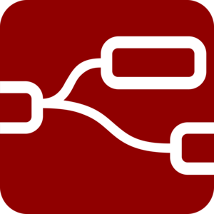

# 👋 Hi, I’m Sean, aka @SeanP2001
- 🐉 I'm from Wales
- 🎓 I have a BEng in Computer Systems Engineering
- 🎓 I'm studying MSc Advanced Computer Science
- 👀 I’m interested in embedded systems, IoT and machine learning
- 🌱 I’m currently learning C++ and Python

## :zap: My Projects
I enjoy building electronics projects using microcontrollers. Most of my public repositories are personal projects which I do for fun. I also document some of my university projects here.

## :technologist: My Workflow

My embedded systems projects tend to follow these steps:
- Make a breadboard prototype
- Design a PCB in KiCAD and send it for manufacturing
- Solder and test the PCB
- Design an enclosure in Fusion360 and 3D print it
- Assemble the project
- Program it in C++
- Record, edit and upload a demonstration video to [my YouTube Channel](https://www.youtube.com/channel/UClFBnp5rqOyc82csVUf3YfQ)
- Write up the project README to document the process and provide all of the information to recreate the project.

## 🧰 Languages and Tools:

## :chart_with_upwards_trend: My GitHub Stats

 | 
---|---

## :heavy_check_mark: My Most Complete Work

## :memo: What I am Working On

- An application to convert PCB design files into CNC toolpaths (made with C++ & QT).
- A V3 of my Sunrise Alarm project with the aim of making a more premium feeling device.
- A to do list manager written in C#.

<!---
SeanP2001/SeanP2001 is a ✨ special ✨ repository because its `README.md` (this file) appears on your GitHub profile.
You can click the Preview link to take a look at your changes.
--->
